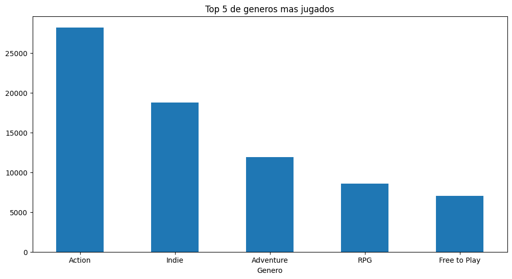

# Proyecto-Individual-Nro-1

Este repositorio contiene el código y la documentación relacionada con el Proyecto Individual Número 1.

En este proyecto, se realiza una serie de tareas de extracción, transformación y carga de datos (ETL), así como análisis exploratorio de datos (EDA) en conjunto con la preparación de datos para el desarrollo de una API.

Voy a resumir cada parte de lo hecho en cada instancia. Para obtener detalles específicos sobre las acciones realizadas en cada parte, consultar los archivos correspondientes, que están debidamente comentados.

## Índice
1. [ETL](#etl)
2. [Desarrollo API](#api)
3. [Análisis exploratorio de los datos](#eda)
4. [Modelo de Aprendizaje Automático](#ml)
5. [Contacto](#contacto)

## <a name="etl">ETL</a>
El manejo de los datos, la eliminación y la interpretación están a cargo de las funciones solicitadas para el desarrollo de la API.

### Steam games [(ETL_Steam_Games.ipynb)](https://github.com/DamianAlbarino/Proyecto-Individual-Nro-1/blob/main/ETL%20-%20EDA/ETL_Steam_games.ipynb)
En este cuaderno Jupyter, se lleva a cabo el procesamiento de datos para el conjunto de datos de juegos de Steam.

#### Eliminación de filas nulas
Desde un principio, se observa un gran número de filas con valores nulos. Estas filas se eliminan y luego se procede a analizar cada columna.

#### Columnas importantes
Se da prioridad a ciertas columnas que se consideran relevantes para el desarrollo de la API, estas incluyen: `id, genres, price, release date y developer`.

#### `ID`
En la columna "id", se realizan las siguientes acciones:
- Eliminación de valores nulos y duplicados.
- Cambio del tipo de dato a INT.

#### `Genres`
En la columna "genres", se realiza el siguiente procesamiento:
- Tratamiento de valores nulos. Se utiliza la información de la columna "tags" para rellenar los nulos en "genres". 
- Los demás valores nulos son eliminados.

#### `Price`
En la columna "price", se lleva a cabo el siguiente procesamiento:
- Identificación de todos los valores únicos.
- Establecimiento en 0.0 de los valores nulos y de aquellos que corresponden a juegos con "tags" o género "Free to Play". También se ajustan a 0.0 los que tienen valores como "Free," "Demo," "Play" e "Install".
- Eliminación de datos nulos, ya que no se dispone de información para completarlos.
- Redondeo de los valores a 2 decimales.

#### `Release data`
La columna "release date" presenta diferentes formatos de fecha. 
- Se busca obtener únicamente el año de lanzamiento. 
- Para ello, se procesa cada tipo de formato de fecha para extraer el año.
Los datos nulos y aquellos que no tienen un formato de fecha válido se eliminan.

#### Por ultimo
Se verifica que no queden valores vacíos en las columnas procesadas y se eliminan el resto de las columnas antes de exportar los datos en un formato JSON comprimido en gzip.

### User Reviews [(ETL_user_reviews.ipynb)](https://github.com/DamianAlbarino/Proyecto-Individual-Nro-1/blob/main/ETL%20-%20EDA/ETL_user_reviews.ipynb)

En este cuaderno Jupyter, se lleva a cabo el procesamiento de datos para el conjunto de datos de las reviews de los usuarios.

#### Transformación de los datos

Se realiza la siguiente transformación de los datos:
- Se separan todas las reviews y se genera una fila por cada review dentro de la columna "reviews", donde cada elemento contiene múltiples reviews del mismo usuario. Estas se concatenan para facilitar su procesamiento.
- Se eliminan filas y columnas con valores nulos, considerándolos como datos irrelevantes.

#### Creación de la columna de análisis de sentimiento (`Feature Engineering`)

Se crea la columna `"sentiment_analysis"` utilizando la librería nltk, que incluye la herramienta Sentiment Vader, un modelo entrenado para puntuar un texto como positivo, neutro o negativo. El análisis produce un diccionario de la forma {'neg': valor, 'neu': valor, 'pos': valor, 'compound': valor}. El valor "compound" representa la puntuación total de la oración compuesta, con un rango entre -1 y 1.
- Se utiliza la puntuación "compound" para categorizar la review como negativa (si x < -0.5), neutra (-0.5 >= x <= 0.5) o positiva (si x > 0.5). Luego se redondea a un valor entero (-1, 0, 1). Además, se suma 1 a ese valor para obtener la referencia pedida en el ejercicio (malo 0, neutro 1, positivo 2).

#### Por último

Se verifican las columnas procesadas y se elimina la columna "review" antes de exportar los datos en un formato JSON comprimido en gzip.

### User Items [(ETL_user_items.ipynb)](https://github.com/DamianAlbarino/Proyecto-Individual-Nro-1/blob/main/ETL%20-%20EDA/ETL_users_items_ETL.ipynb)

En este cuaderno Jupyter, se lleva a cabo el procesamiento de datos para el conjunto de datos de los items que posee cada usuario.

Este proceso de ETL es el más breve, ya que se centra en eliminar columnas innecesarias para el desarrollo de la API. Los datos procesados se exportan en un archivo CSV comprimido en formato gzip.
 
## <a name="api">Desarrollo API</a>

API deployada en Render. Link: https://proyecto-individual-nro-1.onrender.com/docs

### Función "developer"
La función <b>`developer`</b> recibe como parámetro una desarrolladora (str) y devuelve la cantidad de items y el porcentaje de items gratuitos por año del desarrollador solicitado.

En esta función se verifica si existe la desarrolladora solicitada en el conjunto de datos. En caso de que no se encuentre en el dataset, se retorna {'Error':'No existe el desarrollador'}. Una vez verificado que la desarrolladora existe, se crea una lista de los años en los que hubo lanzamiento de items por parte de la empresa desarrolladora. Luego, se agrupa el DataFrame por año y se realiza un recuento del total de items lanzados y cuántos de esos son gratuitos. 

El resultado se presenta en un formato similar a este:
`[
  {
    "Año": 2017,
    "Cantidad de Items": 1,
    "Contenido Free": "100.0%"
  }
]`

### Función "userdata"

La función <b>`userdata`</b> recibe como parámetro un usuario (str) y devuelve la cantidad de dinero gastado por el usuario, el porcentaje de recomendación y la cantidad de items que posee.

En la función se verifica si existe el usuario en el conjunto de datos. En caso de que no exista, se retorna `{'Error':'No existe el usuario'}`. Una vez verificado que el usuario existe, se filtran los conjuntos de datos por el usuario y se obtiene la cantidad de items y las recomendaciones contando sus reviews. Para calcular el gasto total, se revisan todos los items que posee el usuario y se suma el precio de cada uno. 

El resultado se presenta en un formato similar a este:
`{
  "Usuario": "Sp3ctre",
  "Dinero gastado": "248421.96 USD",
  "% de recomendación": "62.5%",
  "Cantidad de items": "571"
}`

### Función "UserForGenre"
La función <b>`UserForGenre`</b> recibe como parámetro un género y devuelve el usuario con más horas jugadas y la acumulación de horas jugadas por año de lanzamiento.

Para lograr esto, se desarrolló un dataset específico para esta función, ya que el procesamiento necesario para proporcionar una respuesta en tiempo real no era viable por Render. El proceso de formación de este dataset se encuentra detallado en el cuaderno Jupyter ETL - EDA\ETL_UserForGenre.ipynb.

En esta función, se verifica si existe el género proporcionado en el conjunto de datos. En caso de que no exista, se retorna `{'Mensaje':'No se encuentran horas registradas para este género'}`. Si el género existe, la función devuelve la información previamente mencionada, que ya se encuentra cargada en el dataset específico. 

Ejemplo de retorno: `{
  "Usuario con más horas jugadas para Género Indie": "REBAS_AS_F-T",
  "Horas jugadas": {
    "Año 1999": "Horas: 0.0",
    "Año 2001": "Horas: 11.0",
    "Año 2003": "Horas: 1863.0",
    "Año 2005": "Horas: 0.0",
    "Año 2006": "Horas: 1673.0",
    "Año 2007": "Horas: 1070.0",
    "Año 2008": "Horas: 1366.0",
    "Año 2009": "Horas: 28993.0",
    "Año 2010": "Horas: 21487.0",
    "Año 2011": "Horas: 100155.0",
    "Año 2012": "Horas: 148459.0",
    "Año 2013": "Horas: 169349.0",
    "Año 2014": "Horas: 326927.0",
    "Año 2015": "Horas: 751765.0",
    "Año 2016": "Horas: 815989.0",
    "Año 2017": "Horas: 33887.0"
  }
}`

### Función "best_developer_year"
La función <b>`best_developer_year`</b> recibe como parámetro un año (int) y devuelve el top 3 de desarrolladores más recomendados por los usuarios.

En esta función, se verifica si se encuentra el año proporcionado en el conjunto de datos. En caso de que no existan lanzamientos en ese año, se retorna `{'Error':'No hay ningún lanzamiento ese año'}`. Una vez verificado que se encuentra el año, se reúnen las valoraciones de sentimiento (sentiment_analysis) y se calcula el top 3 de desarrolladores más recomendados por los usuarios.

Si no hay ninguna revisión para ese año, la función retorna `{'Error':'No hay ninguna revisión para ese año'}`. En caso contrario, se presenta el top 3 de desarrolladores más recomendados en un formato similar al siguiente: `{"Puesto 1": "Edge Of Reality",
  "Puesto 2": "Coffee Stain Studios",
  "Puesto 3": "New World Interactive"}`

### Función "developer_reviews_analysis"

La función <b>`developer_reviews_analysis`</b> recibe como parámetro el nombre de una desarrolladora (str) y devuelve el total de revisiones positivas y negativas que tiene. Para lograr esto, primero verifica si la desarrolladora existe en el conjunto de datos. Si no se encuentra, la función devuelve `{'Error':'No existe el desarrollador'}`. En caso de que la desarrolladora exista, filtra el conjunto de datos por el nombre de la desarrolladora solicitada y suma las revisiones con `sentiment_analysis = 2` (positivas) y `sentiment_analysis = 0` (negativas).

Ejemplo de retorno: 
`{
  "Valve": [
    "Negative = 558",
    "Positive = 4446"
  ]
}`

### Funcion "recomendacion_usuario"
Esta funcion se va a explicar mas adelante con el [modelo de aprendizaje automatico](#ml).

## <a name="eda">Análisis exploratorio de los datos [(EDA_Datasets.ipynb)](https://github.com/DamianAlbarino/Proyecto-Individual-Nro-1/blob/main/ETL%20-%20EDA/EDA_Datasets.ipynb)</a>

### Top 5 juego con mas horas jugadas (playtime_forever)
Podemos observar los 5 juegos con mas horas jugadas por todos los usuarios.

### Analisis de price
Podemos observar que la mayoria de los juegos son gratis, y hay algunos outliers que decido mantenerlos.

### Analisis de generos

#### Cantidad total de juegos por genero

#### Top 5 de generos mas jugados

### Cantidad de juegos lanzados por año

### Analisis de recommend

#### Cantidad de recomendaciones

#### Top 5 de juegos mas recomendados

### Analisis de sentiment_analysis

#### Cantidad total de sentiment_analysis

#### Top 5 de juegos con mejor reviws segun segun sentiment_analysis

## <a name="ml">Modelo de Aprendizaje Automático [(ML_Opcion_2.ipynb)](https://github.com/DamianAlbarino/Proyecto-Individual-Nro-1/blob/main/ML/ML_Opcion_2.ipynb)</a>

En el notbook, se presenta la creación de un modelo de aprendizaje automático utilizando el conjunto de datos previamente explorado en el Análisis Exploratorio de Datos (EDA).

Para este modelo, se ha elegido utilizar el algoritmo SVD (Singular Value Decomposition) de la biblioteca Surprise. El objetivo es predecir las calificaciones de los usuarios para los elementos del conjunto de datos para hacer un sistema de recomendacion usuario-item.

El proceso consta de los siguientes pasos:

1. **Creación de las Calificaciones:** Para entrenar el modelo, se genera una `calificación` a partir de la suma de las columnas `recommend` (0 o 1) y `sentiment_analysis` (0, 1, 2). Estas calificaciones se escalan en una clasificación que varía de 0 a 3.

2. **Selección de Características:** Se seleccionan las características relevantes para el modelo, incluyendo `user_id`, `item_name` y la `calificación` creada en el paso anterior.

3. **Entrenamiento del Modelo:** El conjunto de datos se divide en un 70% para entrenamiento y un 30% para pruebas. Luego, se crea el modelo SVD, se entrena con los datos de entrenamiento y se evalúa su rendimiento utilizando la métrica RMSE (Error Cuadrático Medio de la Raíz). El valor obtenido indica la precisión del modelo, obteniendo un valor aceptable para su utilizacion.

4. **Optimización de Hiperparámetros:** Se ajustan los hiperparámetros del modelo para mejorar su rendimiento. Esto se aplica en la creación del modelo, y el proceso de entrenamiento se repite con los nuevos hiperparámetros.

Finalmente, el modelo entrenado se guarda en formato Pickle para poder ser utilizado en la API.

### Función "recomendacion_usuario"

La función **`"recomendacion_usuario"`** recibe como parámetro el nombre de un usuario (str) y devuelve una lista de los 5 juegos recomendados para ese usuario.

El proceso de recomendación se realiza de la siguiente manera:

1. Se verifica si el usuario existe en el conjunto de datos. Si no se encuentra, la función retorna `{'Error': 'El usuario no existe'}`.

2. Si el usuario existe, se filtran los juegos que ya posee el usuario y se eliminan de la lista de juegos disponibles para que no se le recomienden juegos que ya tiene.

3. A continuación, importamos el modelo de recomendación previamente entrenado, que se encuentra en formato pickle.

4. Se genera una clasificación para el usuario con respecto a todos los juegos disponibles en el conjunto de datos. El modelo utiliza esta clasificación para predecir qué juegos podrían gustarle al usuario.

5. Finalmente, la función selecciona y retorna los 5 juegos con la mayor probabilidad de que le gusten al usuario, basándose en las predicciones del modelo.

Ejemplo de retorno: `{
  "Juegos recomendados para Sp3ctre": [
    "King Arthur's Gold",
    "Everlasting Summer",
    "Call of Juarez Gunslinger",
    "The Wolf Among Us",
    "SUPERHOT"
  ]
}`

# <a name="contacto">Contacto</a>

Si tienes alguna pregunta, sugerencia o simplemente quieres ponerte en contacto conmigo, estaré encantado de hablar contigo. Puedes alcanzarme de las siguientes maneras:

- Correo Electrónico: [damianalbarino@hotmail.com](mailto:damianalbarino@hotmail.com)
- LinkedIn: [Damián Nicolas Albariño](https://www.linkedin.com/in/dami%C3%A1n-nicol%C3%A1s-albari%C3%B1o-b03b9a1ab/)

¡Gracias por visitar mi proyecto!